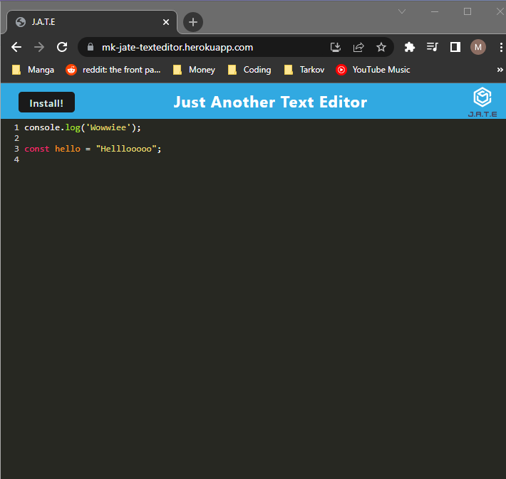

# JATE-Just Another Text Editor

## Table of Contents

1.[Description](#Description)  
2.[Link](#Link)  
3.[Installation](#Installation)  
4.[Usage](#Usage)  
5.[Contributing](#Contributing)  
6.[Tests](#Tests)  
7.[License](#License)  
8.[Credits](#Credits)  
9.[Questions](#Contacts)

## Link to repo

https://github.com/mkang987/JATE-JustAnotherTextEditor

Live Link: https://mk-jate-texteditor.herokuapp.com/

## Description

JATE is a text editor on the web which can also be installed locally using the magical technology of PWA.

## Licenses

  
[License Information](./generatedLicense.md)

## Installation

To install the webapp you just need to go to the live link and press the install button.

## Usage

run it on your web browser or install it locally using the Install button

## Contribution

N/A

## Credits

N/A

## Contacts

Contact me via Email at mkang987@gmail.com
